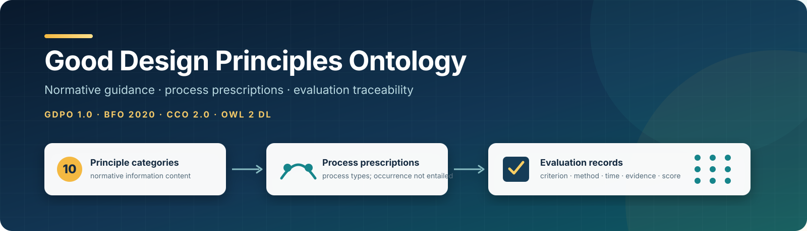
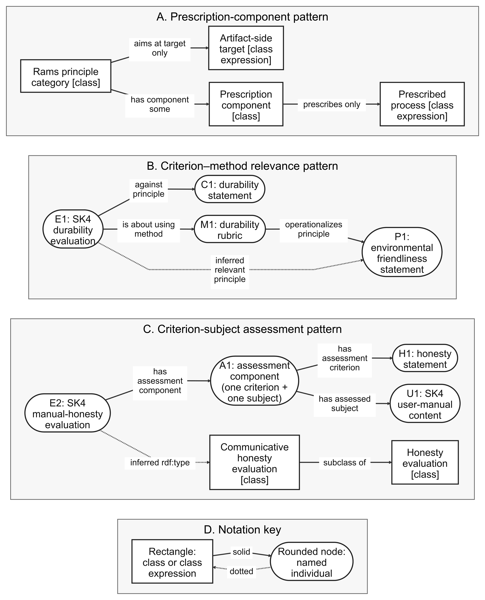

<p align="center">
  
</p>

# Good Design Principles Ontology (GDPO)

**Public baseline: v1.0.0, 21 September 2026**

GDPO is an applied ontology for representing Dieter Rams’ ten principles of
good design as normative information content, artifact-associated targets,
process guidance, and traceable design evaluations. It aligns with BFO 2020
and the Common Core Ontologies (CCO).

The ontology does not decide whether an artifact is good design. It provides a
semantic structure for documenting principles, methods, criteria, assessed
artifacts, evaluation processes, temporal context, and scores.

## Release identity

| Item | Value |
|---|---|
| Public release | `v1.0.0` |
| Stable ontology IRI | `https://www.ramsprinciplesofgooddesign.com/GoodDesignPrinciplesOntology` |
| Version IRI | `https://www.ramsprinciplesofgooddesign.com/GoodDesignPrinciplesOntology20260921v1.0.0` |
| Canonical serialization | [`ontology/gdpo-1.0.0.ttl`](ontology/gdpo-1.0.0.ttl) |
| License | [CC BY 4.0](LICENSE) |

## Contents

- [`ontology/`](ontology/) contains the OWL ontology and local XML catalog.
- [`imports/`](imports/) contains checksum-verified BFO and CCO dependency
  snapshots and their notices.
- [`examples/`](examples/) contains synthetic ABox data for inspection and
  regression testing.
- [`queries/`](queries/) contains twenty competency questions and exact result
  contracts.
- [`shapes/`](shapes/) contains SHACL conformance shapes.
- [`validation/`](validation/) contains executable structural, SHACL, query,
  and OWL-DL checks.
- [`docs/`](docs/) provides the [overview](docs/overview.md),
  [architecture](docs/architecture.md), [Rams-principles mapping](docs/rams-principles-mapping.md),
  [competency questions](docs/competency-questions.md), [manuscript-evidence
  crosswalk](docs/manuscript-evidence.md), imports, reproducibility,
  [validation](docs/validation.md), [recorded validation results](docs/validation-results-v1.0.0.md),
  and governance.

## Quick start

Open [`ontology/gdpo-1.0.0.ttl`](ontology/gdpo-1.0.0.ttl) in Protégé or another
OWL tool. The committed [`ontology/catalog-v001.xml`](ontology/catalog-v001.xml)
maps GDPO and its dependencies to the local files.

To run the executable checks:

```bash
python3 -m venv .venv
source .venv/bin/activate
python3 -m pip install -r requirements.txt
python3 validation/validate_suite.py
```

The ROBOT/HermiT check is optional when its runtime is unavailable locally and
is required by the repository workflow. See [`docs/validation.md`](docs/validation.md).

## Core modeling ideas

GDPO keeps the following distinct:

- a principle category and the named information-content statement that bears
  its canonical formulation;
- a principle and the quality, function, disposition, process, or information
  content it concerns;
- a method specification, the evaluation process that applies it, and the
  evaluation record produced by that process; and
- a composite evaluation record and the individual criterion–subject
  assessment components it contains.

The last distinction is important for composite audits. A communicative-honesty
evaluation is classified only when one assessment component pairs an honesty
criterion with design communication content. Independent record-level links do
not establish that pairing.

See [`docs/modeling-patterns.md`](docs/modeling-patterns.md) for the full
pattern descriptions.

## Manuscript support

The public release is the evidence companion for the GDPO manuscript. It keeps
the paper, authoring history, and private development records out of the public
repository while making the ontology and its inspectable evidence available.

- [`docs/manuscript-evidence.md`](docs/manuscript-evidence.md) maps the paper's
  modeling and validation claims to public files.
- [`docs/figures/gdpo-normative-evaluative-spine.svg`](docs/figures/gdpo-normative-evaluative-spine.svg)
  is the accessible vector form of the reusable-pattern figure; its Mermaid
  source and PNG rendering are alongside it.
- [`docs/rams-principles-mapping.md`](docs/rams-principles-mapping.md) provides
  a readable mapping from the ten principle categories to their targets and
  prescribed process types.

### Reusable modeling-pattern figure

<p align="center">
  
</p>

The [SVG](docs/figures/gdpo-normative-evaluative-spine.svg),
[Mermaid source](docs/figures/gdpo-normative-evaluative-spine.mmd), and
[accessible explanation](docs/manuscript-evidence.md#reusable-pattern-figure)
are also available.

### Semantic architecture

<p align="center">
  
</p>

See the [architecture page](docs/architecture.md) for an explanation of the
relations shown.

## Competency questions

GDPO provides twenty executable competency-question contracts. Each has a
query or structural check and an exact expected-result contract; run them with
`python3 validation/validate_queries.py`.

| ID | Question |
|---|---|
| CQ-01 | Which target class expressions are associated with each principle? |
| CQ-02 | Which process types constrain each principle's prescriptions? |
| CQ-03 | Which lifecycle-stage process types constrain intended applicability? |
| CQ-04 | Which principles occur in the Rams ten-principles specification? |
| CQ-05 | How are principles distinguished from their artifact-side targets? |
| CQ-06 | What artifacts have been evaluated? |
| CQ-07 | Which criterion was an artifact evaluated against? |
| CQ-08 | During which temporal region was an evaluation assessed? |
| CQ-09 | Which method specification was used? |
| CQ-10 | What scores and scales are associated with an evaluation? |
| CQ-11 | Which methods operationalize which principles? |
| CQ-12 | Which principles are relevant because of method use? |
| CQ-13 | Which principles were explicitly selected as criteria? |
| CQ-14 | Which records are honesty evaluations? |
| CQ-15 | Which records include a paired honesty–communication assessment? |
| CQ-16 | Which communication content entities occur as assessed subjects? |
| CQ-17 | How are material and functional honesty distinguished? |
| CQ-18 | Which evaluation process produced a record? |
| CQ-19 | Which agent carried out an evaluation process? |
| CQ-20 | Which information content entities have material-bearer provenance? |

The [complete competency-question page](docs/competency-questions.md) links
each question to its executable evidence and the
[machine-readable registry](queries/competency-question-registry.json).

## Reproducibility and citation

The repository supplies the examples, queries, shapes, and validation tools
needed to inspect the modeled claims. Instructions are in
[`docs/reproducibility.md`](docs/reproducibility.md).

Please cite GDPO 1.0 using [`CITATION.cff`](CITATION.cff) and identify the
release version used. See [`NOTICE`](NOTICE) for source attribution and
third-party notices.
