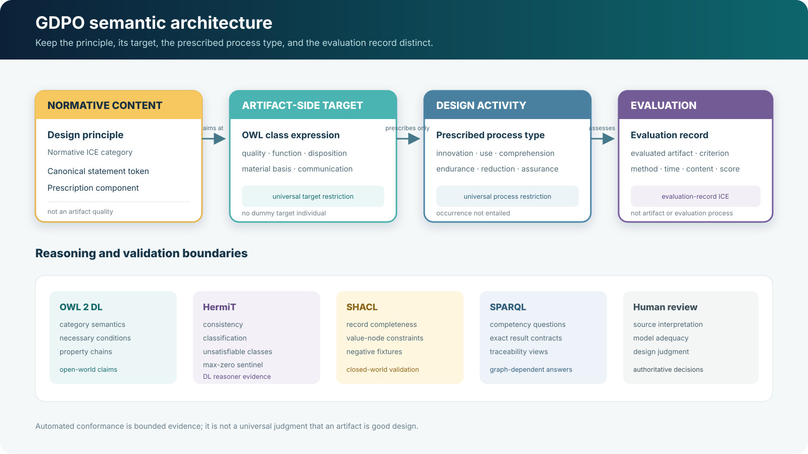

# Architecture

GDPO keeps normative information, artifact-associated targets, prescribed
process types, and evaluation records distinct. It does not turn a principle
into an artifact property or a completed evaluation.

## Core flow

1. A design-principle category constrains the class of an artifact-associated
   target.
2. Its prescription components constrain compatible process and lifecycle-stage
   types without asserting that an occurrence exists.
3. A method specification may operationalize one or more principles.
4. An evaluation process assesses an artifact and produces an evaluation
   record with temporal and agent context.
5. A composite record can contain criterion-subject assessment components, so
   one selected principle can be paired with one assessed subject.
6. Method-derived relevance is kept distinct from the criterion explicitly
   selected for a record.

OWL supplies the reusable category and restriction semantics under the
open-world assumption. The accompanying SHACL profile checks a bounded,
closed-world application-data pattern. Competency questions and fixtures test
retrieval and named inferences over supplied graphs; none of these mechanisms
determines whether a particular artifact is good design.

For the corresponding formal patterns, see
[modeling patterns](modeling-patterns.md), the
[Rams-principles mapping](rams-principles-mapping.md), and the
[public figure assets](figures/gdpo-normative-evaluative-spine.svg).
