# Manuscript evidence crosswalk

This public release is the evidence companion for the GDPO manuscript. It
provides inspectable ontology material and executable checks without publishing
the manuscript, its tracked revisions, or private development history.

| Manuscript claim | Public evidence |
|---|---|
| Principles, targets, prescriptions, and evaluation records are categorically distinct. | [Overview](overview.md), [architecture](architecture.md), [modeling patterns](modeling-patterns.md), and [`ontology/gdpo-1.0.0.ttl`](../ontology/gdpo-1.0.0.ttl) |
| The ten principle categories have artifact-associated targets and compatible prescribed process types. | [Rams-principles mapping](rams-principles-mapping.md), [CQ-01 to CQ-04](competency-questions.md), and the query/result contracts in [`queries/`](../queries/) |
| Universal target, process, and lifecycle restrictions do not assert target or process occurrences. | [Modeling patterns](modeling-patterns.md) and the canonical OWL serialization |
| Evaluation records, methods, criteria, processes, times, agents, and scores are traceable. | [CQ-06 to CQ-20](competency-questions.md), [`examples/assessment-fixture.ttl`](../examples/assessment-fixture.ttl), and [`shapes/gdpo-shapes.ttl`](../shapes/gdpo-shapes.ttl) |
| A same-component criterion-subject pair supports the communicative-honesty inference. | [Pattern figure](#reusable-pattern-figure), [`queries/example/a2-4-communicative-honesty.rq`](../queries/example/a2-4-communicative-honesty.rq), and [`validation/validate_assessment_fixture.py`](../validation/validate_assessment_fixture.py) |
| SHACL, competency-question, OWL-RL, import, structural, and release checks are executable. | [Validation](validation.md), [v1.0.0 validation results](validation-results-v1.0.0.md), and [`validation/`](../validation/) |

## Reusable-pattern figure

The accessible SVG is accompanied by its [Mermaid source](figures/gdpo-normative-evaluative-spine.mmd)
and [PNG rendering](figures/gdpo-normative-evaluative-spine.png). Rectangles
denote classes or class expressions; rounded nodes denote named individuals;
solid arrows denote asserted relations, restrictions, or subclass axioms; and
dotted arrows denote inferences.

The examples are synthetic. They test the stated modeling and retrieval
contracts; they are not empirical findings about a product or person.
